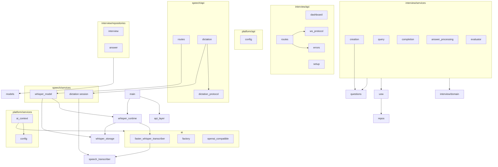

# GrillKit Architecture

GrillKit is an AI-powered technical interview trainer. The stack is **FastAPI** (HTTP + WebSocket), **SQLAlchemy** (SQLite), **Jinja2** templates, and an **OpenAI-compatible** AI adapter. Code is organized **by feature** (`interview/`, `speech/`, `platform/`) with shared infrastructure in `shared/`. Within each feature: transport in `api/`, orchestration in `services/`, pure rules in `domain/`, persistence in `repositories/` (interview only), all transactional work via `UnitOfWork` in `shared/infrastructure/`.

## Project Map

```
grillkit/
├── app/
│   ├── main.py                 # create_app(), router registration, lifespan → init_db()
│   ├── paths.py                # PROJECT_ROOT, DATA_DIR, CONFIG_PATH, whisper/questions/db paths
│   ├── questions.py            # YAML question loader (data/questions/)
│   ├── templating.py           # Shared Jinja2Templates + static_version()
│   ├── shared/
│   │   ├── domain/
│   │   │   ├── exceptions.py   # InterviewNotFoundError, InterviewNotActiveError, ...
│   │   │   └── locales.py      # SUPPORTED_LOCALES, normalize_locale()
│   │   ├── infrastructure/
│   │   │   ├── database.py     # SQLite engine, SessionLocal, init_db()
│   │   │   ├── models.py       # Interview, Answer ORM models
│   │   │   └── uow.py          # UnitOfWork: uow.interviews, uow.answers, uow.session
│   │   └── repositories/
│   │       └── base.py         # Repository[T], SqlAlchemyRepository[T]
│   ├── ai/
│   │   ├── base.py             # AIProvider protocol
│   │   ├── speech_transcriber.py  # SpeechTranscriber protocol (offline dictation)
│   │   ├── factory.py          # ProviderFactory.from_config()
│   │   ├── openai_compatible.py
│   │   └── faster_whisper_transcriber.py  # SpeechTranscriber via faster-whisper
│   ├── platform/
│   │   ├── api/
│   │   │   ├── config.py       # GET/POST /config (provider settings)
│   │   │   └── deps.py         # ConfigServiceDep
│   │   └── services/
│   │       ├── config.py       # ProviderConfig, ConfigService (data/config.json)
│   │       └── ai_context.py   # ai_provider_from_config() async context manager
│   ├── interview/
│   │   ├── domain/
│   │   │   ├── progress.py     # find_first_unanswered(), require_active(), ...
│   │   │   └── lifecycle.py    # MAX_SCORE_PER_ROUND, compute_interview_score(), ...
│   │   ├── repositories/
│   │   │   ├── interview.py    # InterviewRepository
│   │   │   └── answer.py       # AnswerRepository
│   │   ├── services/
│   │   │   ├── creation.py
│   │   │   ├── query.py
│   │   │   ├── completion.py
│   │   │   ├── answer_processing.py
│   │   │   ├── events.py       # AnswerSavedEvent, EvaluatingEvent, ...
│   │   │   └── evaluator/
│   │   │       ├── service.py
│   │   │       ├── models.py
│   │   │       └── prompts.py
│   │   └── api/
│   │       ├── deps.py         # Interview* service Depends
│   │       ├── dashboard.py    # GET /
│   │       ├── setup.py        # GET/POST /setup, GET /setup/options
│   │       ├── setup_form.py   # setup.html template context
│   │       ├── routes.py       # GET /interview/{id}, WS /interview/{id}/ws
│   │       ├── ws_protocol.py  # InterviewEvent → JSON messages
│   │       └── errors.py       # domain errors → HTTP / WebSocket payloads
│   └── speech/
│       ├── domain/
│       │   └── models.py       # Whisper size → Hugging Face model metadata
│       ├── services/
│       │   ├── whisper_storage.py
│       │   ├── whisper_model.py
│       │   ├── whisper_runtime.py
│       │   └── dictation.py    # DictationSession (PCM buffer → final transcript)
│       └── api/
│           ├── deps.py         # WhisperModelServiceDep
│           ├── routes.py       # GET/POST /speech/model/*
│           ├── page_context.py # speech_model_status template context helper
│           ├── dictation.py    # WS /interview/{id}/dictation
│           └── dictation_protocol.py
├── templates/                  # Jinja2 HTML (dashboard, setup, config, interview, speech_model_*)
├── static/
│   ├── css/styles.css
│   └── js/                     # dictation.js, speech_model.js (interview voice UI)
├── data/
│   ├── config.json             # AI provider + interview locale (gitignored)
│   ├── whisper-models/<size>/  # faster-whisper snapshots (gitignored content)
│   ├── db/grillkit.db          # SQLite database (gitignored, created at runtime)
│   └── questions/              # YAML banks: {language}/{level}/{category}.yaml
├── docker-compose.yml          # Primary deployment (port 8000, ./data volume)
├── docker-entrypoint.sh        # PUID/PGID, ensures data/db writable
├── Dockerfile                  # Multi-stage uv build → uvicorn
└── tests/
```

## HTTP Routes

| Method | Path | Module | Purpose |
|--------|------|--------|---------|
| GET | `/` | `interview/api/dashboard.py` | Interview history (last 20) |
| GET | `/setup` | `interview/api/setup.py` | New interview form (redirects to `/config` if unset) |
| POST | `/setup` | `interview/api/setup.py` | Create interview → redirect `/interview/{id}` |
| GET | `/setup/options` | `interview/api/setup.py` | Cascaded JSON: languages → levels → categories |
| GET | `/config` | `platform/api/config.py` | AI provider configuration form |
| POST | `/config` | `platform/api/config.py` | Test connection (via form dependency), then save |
| POST | `/config/test` | `platform/api/config.py` | Test connection without saving |
| DELETE | `/config` | `platform/api/config.py` | Remove saved provider configuration |
| GET | `/speech/model/status` | `speech/api/routes.py` | Whisper model install status (HTML or JSON) |
| POST | `/speech/model/download` | `speech/api/routes.py` | Start Whisper download for `config.speech_model_size` |
| GET | `/speech/model/options` | `speech/api/routes.py` | JSON size trade-off metadata |
| GET | `/interview/{interview_id}` | `interview/api/routes.py` | Interview page (active or completed) |
| WS | `/interview/{interview_id}/ws` | `interview/api/routes.py` | Real-time answers and completion |
| WS | `/interview/{interview_id}/dictation` | `speech/api/dictation.py` | PCM dictation: `start` → `ready`, audio chunks, `stop` → `final` |
| — | `/static/*` | `main.py` | CSS, JS, and assets |

## Layer Responsibilities

| Package / layer | Responsibility |
|-----------------|----------------|
| `interview/api/`, `speech/api/`, `platform/api/` | HTTP/WebSocket transport, forms, template rendering |
| `*/api/deps.py` | Inject service **classes** via `Depends` (handlers call static methods) |
| `interview/api/ws_protocol.py` | Map `InterviewEvent` dataclasses → interview WebSocket JSON |
| `speech/api/dictation_protocol.py` | Dictation WebSocket message types (`start`, `stop`, `ready`, `final`, `error`) |
| `interview/api/errors.py` | Map `InterviewDomainError` → error payloads |
| `*/services/` | Use-case orchestration (static methods on service classes) |
| `interview/domain/`, `speech/domain/`, `shared/domain/` | Pure rules (no I/O); shared holds cross-cutting exceptions and locales |
| `interview/repositories/` | Interview persistence (SQLAlchemy via `SqlAlchemyRepository`) |
| `shared/infrastructure/uow.py` | Single transaction boundary; exposes `interviews` and `answers` repos |
| `shared/infrastructure/models.py` | ORM models |
| `ai/` | Provider adapters (`AIProvider`, `SpeechTranscriber`) |
| `questions.py` | Read-only YAML question bank access |

Application services are **stateless classes with `@staticmethod`**. FastAPI dependencies in each feature's `deps.py` return the class (e.g. `InterviewQuery`), not instances.

## Module Dependency Graph

Dependencies flow **downward** (caller → callee). Plain-text diagram for editors that do not render Mermaid.

```
main.py ──► lifespan: init_db(), WhisperRuntime.bind_app(), load configured Whisper size
  ├── interview/api/  (dashboard, setup, routes)
  │     ├── routes.py ──► ws_protocol, errors, speech/api/page_context
  │     └── deps.py ──► interview/services/*
  ├── platform/api/config.py ──► platform/services/config, speech/api/page_context
  └── speech/api/  (routes, dictation)
        ├── dictation.py ──► dictation_protocol, dictation session, app.state.speech_transcriber
        └── routes.py ──► speech/services/whisper_model

interview/services/
  ├── creation.py ──► interview/domain/, questions.py, uow
  ├── query.py      ──► interview/domain/, uow
  ├── completion.py ──► evaluator, platform/ai_context, uow
  └── answer_processing.py ──► evaluator, platform/ai_context, uow

platform/services/config.py ──► ai/factory, speech/domain/models, data/config.json
speech/services/
  ├── whisper_model.py ──► whisper_runtime, whisper_storage, Hugging Face hub
  ├── whisper_runtime.py ──► ai/faster_whisper_transcriber, whisper_storage
  └── dictation.py ──► ai/speech_transcriber

shared/infrastructure/uow.py
  └── interview/repositories/ (interview, answer) ──► shared/repositories/base, models
```

On GitHub, the same graph is also available as Mermaid (rendered on github.com only):

<details>
<summary>Mermaid source (GitHub preview)</summary>



</details>

## Naming Convention

| Concept | Name in code |
|---------|----------------|
| Interview ORM model | `Interview` (table `interviews`) |
| Primary key column | `Interview.id` (UUID string) |
| Route / WS path param | `interview_id` (same value as `Interview.id`) |
| Answer FK | `Answer.interview_id` → `interviews.id` |
| Create flow | `interview.services.creation.InterviewCreationService.create_interview()` |
| Read flow | `interview.services.query.InterviewQuery.get_interview()`, `list_dashboard_rows()` |
| Answer flow | `interview.services.answer_processing.AnswerProcessingService` |
| Complete flow | `interview.services.completion.InterviewCompletionService.complete_interview()` |
| UoW repositories | `uow.interviews`, `uow.answers` |
| SQLAlchemy session | `uow.session` |

## Key Models

### Interview (`interviews`)

| Field | Type | Notes |
|-------|------|-------|
| `id` | `str` | UUID v4 primary key |
| `level` | `str` | `junior`, `middle`, `senior` |
| `language` | `str` | Question bank slug (`python`, `database`, …) |
| `locale` | `str` | AI feedback language (`en`, `ru`, …) |
| `category` | `str` | YAML topic slug |
| `question_count` | `int` | Number of questions in session |
| `question_ids` | `str` | JSON list of question IDs in display order |
| `status` | `str` | `active` or `completed` |
| `score` | `int \| None` | Total score when completed |
| `overall_feedback` | `str \| None` | JSON string from final AI evaluation |
| `started_at`, `completed_at` | `datetime` | Session timestamps |

### Answer (`answers`)

| Field | Type | Notes |
|-------|------|-------|
| `id` | `int` | Auto-increment PK |
| `interview_id` | `str` | FK to `interviews.id` (CASCADE delete) |
| `question_id` | `str` | ID from YAML bank |
| `order` | `int` | 1-based display order within session |
| `round` | `int` | `0` = initial question; `1+` = AI follow-up |
| `question_text`, `question_code` | `str` | Snapshot at ask time |
| `answer_text` | `str \| None` | User answer (`None` until submitted) |
| `score`, `feedback` | | Set after AI evaluation (score 1–5) |

Rows are created up front at interview creation (one per question, `round=0`). Follow-up rounds add new `Answer` rows via `AnswerRepository`.

## Data Flow: Configure Provider

```
User → GET /config → ConfigService.get_config()
User → POST /config/test → test only (no save)
User → POST /config → ProviderConfig from form
  → ConfigService.test_connection() → AI provider ping
  → on success: ConfigService.save_config() → data/config.json
User → DELETE /config → ConfigService.delete_config()
```

Setup and interview flows require a saved config; otherwise `/setup` redirects to `/config`.

## Data Flow: Create Interview

```
User → POST /setup (language, topic, level, question_count)
  → locale from ConfigService.get_config() → Interview.locale snapshot
  → InterviewCreationService.create_interview()
       → load_category() from YAML
       → shuffle & pick question_count questions
       → UnitOfWork(auto_commit=True): persist Interview + Answer rows (round=0)
  → Redirect GET /interview/{id}
```

## Data Flow: WebSocket Answer

```
Client → WS {"type":"answer","question_id":"...","answer_text":"..."}
  → AnswerProcessingService.process_answer_submission(interview_id, ...)
       → UoW #1: validate active, save answer_text, load context
       → ai_provider_from_config() → InterviewEvaluatorService (no DB transaction)
       → UoW #2: save score/feedback; optional follow-up Answer row or advance
       → stream_answer_submission() yields saved/evaluating, then feedback after AI
  → event_to_message() per event → client (not batched after evaluation)

Client → WS {"type":"ping"}
  → InterviewQuery.get_interview() → {"type":"pong","status":"active"|"completed"|...}
```

**Server → client message types:** `saved`, `evaluating`, `feedback`, `interview_completed`, `error`, `pong`.

## Data Flow: Dictation WebSocket

Separate from answer/evaluation WS. Requires active interview and loaded transcriber (`app.state.speech_transcriber`).

```
Client → WS connect /interview/{id}/dictation
  → InterviewQuery.get_interview() + require_active()
  → reject if model missing (download via /config → /speech/model/download)

Client → {"type":"start"}
  → DictationSession() → {"type":"ready"}

Client → binary PCM (16-bit LE mono, 16 kHz)
  → DictationSession.append_pcm()

Client → {"type":"stop"}
  → DictationSession.finalize(speech_transcriber, interview.locale)
  → {"type":"final","text":"..."} → connection closes
```

**Server → client message types:** `ready`, `final`, `error`.

## Data Flow: Speech Model Install

```
User → GET /config (speech_model_size, locale)
User → POST /speech/model/download
  → WhisperModelService.start_download(size from config)
       → Hugging Face snapshot → data/whisper-models/<size>/
       → WhisperRuntime.load_size(size) → app.state.speech_transcriber
User → GET /speech/model/status (HTMX poll while downloading)
```

Configured size and locale live in `data/config.json` (`ProviderConfig`). Transcription `language` follows the interview locale snapshot, not live config changes mid-session.

## Data Flow: Complete Interview

```
Client → WS {"type":"complete"}
  → InterviewCompletionService.complete_interview(interview_id)
       → build Q&A summary → AI overall evaluation
       → UnitOfWork: save overall_feedback, mark completed, set score
       → returns [EvaluatingEvent, InterviewCompletedEvent]
  → events_to_messages() → client
```

## Data Access Pattern

```python
from app.interview.domain.lifecycle import compute_interview_score
from app.shared.infrastructure.models import Interview
from app.shared.infrastructure.uow import UnitOfWork

with UnitOfWork(auto_commit=True) as uow:
    interview = Interview(id=..., level=..., status="active", ...)
    uow.interviews.add(interview)
    for answer in answers:
        uow.answers.add(answer)

with UnitOfWork(auto_commit=True) as uow:
    db_interview = uow.interviews.get(interview_id)
    score = compute_interview_score(db_interview)
    uow.interviews.mark_completed(db_interview, score)
```

`InterviewRepository.get()` eagerly loads `answers` via `selectinload`. Prefer `UnitOfWork` in services for all transactional work.

## Scoring

- Each answered round (initial or follow-up) is scored **1–5** by the AI.
- Maximum points per round: `MAX_SCORE_PER_ROUND` (5) in `app/interview/domain/lifecycle.py`.
- Session total: `compute_interview_score()` sums all non-null answer scores.
- Per-question breakdown: `build_per_question_score_breakdown()` for completion feedback.

## Persistence & Configuration

| Path | Purpose |
|------|---------|
| `data/db/grillkit.db` | SQLite database (`DATABASE_URL` in `database.py`) |
| `data/config.json` | AI provider, `locale`, `speech_model_size` (`platform.services.config.ConfigService`) |
| `data/whisper-models/<size>/` | Offline faster-whisper snapshots (`WhisperModelService`) |
| `data/questions/{language}/{level}/{category}.yaml` | Question banks |

Docker Compose mounts `./data:/app/data` so DB and config survive container restarts. `init_db()` runs on app startup (`lifespan` in `main.py`).

## Question Banks

Current YAML banks under `data/questions/`:

- **python** — junior / middle / senior (multiple categories per level)
- **database** — junior / middle / senior (SQL, design, NoSQL, etc.)

`questions.py` discovers languages and categories from the filesystem. Setup uses `GET /setup/options` for cascaded form updates.

## Current Limitations

- Only one AI adapter type is implemented: `openai-compatible` (`ProviderFactory`)
- Preset provider names in UI/docs may list OpenAI, Anthropic, Ollama, etc., but all use the same HTTP client shape
- Interview interaction for answers is WebSocket-only (`GET` page + `WS /interview/{id}/ws`)
- Per-round scores and feedback are stored during the interview but shown in the UI only after completion (WebSocket `feedback` advances questions without score bubbles)
- AI follow-ups: up to `InterviewEvaluatorService.MAX_FOLLOW_UP_DEPTH` (2) extra rounds per question
- YAML fields `follow_ups` and `expected_points` are loaded but not used for scoring (follow-ups are AI-generated)
- Deleting or resetting `data/db/grillkit.db` is required when ORM schema changes locally (no migrations yet)
- Speech: offline Whisper only; model and download progress are **per process** (not shared across multiple uvicorn workers)
- Dictation returns a **single final transcript** on stop (no streaming `partial` messages)
