# GrillKit Architecture

User-facing overview, screenshots, and quick start: [README.md](README.md).

GrillKit is an AI-powered technical interview trainer. The stack is **FastAPI** (HTTP + WebSocket), **SQLAlchemy** (SQLite), **Alembic** (schema and data migrations), **Jinja2** templates, and **OpenAI-compatible** plus **faster-whisper** adapters in `ai/`. Code is organized **by feature** (`interview/`, `theory/`, `coding/`, `speech/`, `question_voice/`, `platform/`) with cross-cutting code in `shared/`.

**Session orchestration** lives in `interview/`: setup, dashboard, session shell (`Interview`), page composition, phase order, completion, results hub, and `selection_spec` v2 (`session_mode`). **Theory flow** lives in `theory/`: questions, tasks, timer, WebSocket/audio submit, AI evaluation, and post-session review. **Coding flow** lives in `coding/`: YAML task banks, Monaco UI, Judge0 Run attempts, WebSocket submit, AI evaluation, and post-session review. The interview shell does not own section tasks; `InterviewRead` composes theory task rows at read time via `theory_sections` + `answers`, and coding context from `coding_sections` + `coding_tasks`.

Within each feature: transport in `api/`, orchestration in `services/`, Pydantic read models in `schemas/` (where present), persistence in `repositories/`. Domain layers use frozen aggregates and value objects separate from ORM and DTOs. Transactions use `InterviewUnitOfWork` / `TheoryUnitOfWork` extending `shared/infrastructure/uow.py`. APIs do not expose SQLAlchemy models on the wire.

## Terminology

| Term | Meaning | Examples |
|------|---------|----------|
| **locale** | Language for AI feedback, follow-ups, and speech dictation | `en`, `ru` — stored on `Interview.locale` and `AppConfig` |
| **track** | Question bank slug (top-level directory under `data/questions/`) | `python`, `database`, `system-design` |
| **level** | Difficulty tier within a track | `junior`, `middle`, `senior` |
| **category** | Topic YAML file within a track/level | `basics`, `redis`, `system-design` |

## Project Map

```
grillkit/
├── app/
│   ├── main.py                 # create_app(), router registration, lifespan → run_migrations()
│   ├── templating.py           # Shared Jinja2Templates + static_version()
│   ├── shared/
│   │   ├── paths.py            # PROJECT_ROOT, DATA_DIR, CONFIG_PATH, whisper/questions/db paths
│   │   ├── questions.py        # YAML theory question loader (data/questions/)
│   │   ├── coding.py           # YAML coding task loader (data/coding/)
│   │   ├── locales.py          # SUPPORTED_LOCALES, normalize_locale()
│   │   ├── structured_evaluation.py  # Shared LLM JSON parse helpers
│   │   ├── evaluation_models.py      # Section/session evaluation DTOs
│   │   ├── task_timer.py             # Per-round timer helpers
│   │   ├── infrastructure/
│   │   │   ├── database.py     # engine, SessionLocal, DATABASE_URL env, run_migrations()
│   │   │   ├── models.py       # Interview, TheorySection, Answer, CodingSection, CodingTask, CodeRunAttempt
│   │   │   ├── audio_wav.py    # Canonical mono 16 kHz WAV validation
│   │   │   ├── hf_hub_runtime.py, hf_download_progress.py, artifact_*
│   │   │   └── uow.py          # Base UnitOfWork: session, commit, rollback
│   │   └── repositories/
│   │       └── base.py         # Repository[T], SqlAlchemyRepository[T]
│   ├── ai/
│   │   ├── base.py             # AIProvider protocol
│   │   ├── speech_transcriber.py  # SpeechTranscriber protocol (offline dictation)
│   │   ├── audio_probe.py      # Minimal WAV bytes for connectivity / audio tests
│   │   ├── factory.py          # ProviderFactory.from_config()
│   │   ├── llm_models.py       # Catalog entry types (incl. accepts_audio_input)
│   │   ├── openai_compatible.py
│   │   └── faster_whisper_transcriber.py
│   ├── platform/
│   │   ├── schemas.py          # Config page read models, NewLLMModel, mappers
│   │   ├── api/
│   │   │   ├── config.py       # GET/POST /config
│   │   │   └── deps.py
│   │   └── services/
│   │       ├── config.py       # AppConfig, ConfigService (data/config.json)
│   │       ├── llm_catalog.py  # data/llm_models.json load/save/select
│   │       ├── speech_runtime.py  # SpeechRuntimeCoordinator (Whisper + Piper lifecycle)
│   │       ├── speech_settings.py
│   │       └── ai_context.py   # ai_provider_from_config() async context manager
│   ├── interview/              # Session orchestrator (shell, setup, dashboard, completion)
│   │   ├── domain/             # Interview shell aggregate, SessionSelection, serialization
│   │   ├── schemas/            # InterviewRead, dashboard/page context
│   │   ├── services/rules/     # selection_spec v2, display titles
│   │   ├── repositories/
│   │   │   ├── interview.py    # shell get/save, list_recent read models
│   │   │   ├── mappers.py      # ORM ↔ shell ↔ InterviewRead (+ theory compose)
│   │   │   └── uow.py          # InterviewUnitOfWork (interviews + theory_sections)
│   │   ├── services/
│   │   │   ├── creation.py     # SessionCreationService
│   │   │   ├── page.py         # SessionPageService
│   │   │   ├── completion.py   # SessionCompletionService
│   │   │   ├── dashboard.py
│   │   │   ├── query.py
│   │   │   ├── phases.py       # multi-section phase order + prefetch hooks
│   │   │   ├── sections.py     # Section registry and shared section DTOs
│   │   │   ├── evaluation_aggregator.py
│   │   │   ├── session_evaluator.py
│   │   │   ├── results_page.py # SessionResultsPageService (completed hub)
│   │   │   ├── section_feedback.py, section_evaluation.py, scoring.py
│   │   │   └── events.py       # Shared WS/NDJSON event types (theory + coding)
│   │   └── api/
│   │       ├── deps.py
│   │       ├── dashboard.py    # GET /
│   │       ├── setup.py        # GET/POST /setup, cascaded options
│   │       ├── setup_form.py
│   │       ├── routes.py       # GET /interview/{id}, question-audio
│   │       ├── results.py      # GET /results, /theory, /coding (completed sessions)
│   │       └── errors.py
│   ├── coding/                 # Coding section (tasks, Judge0 runner, WS/API, evaluator)
│   │   ├── domain/             # CodingSection, CodingTask, CodeRunAttempt aggregates
│   │   ├── repositories/       # coding_section repo, mappers, CodingUnitOfWork
│   │   ├── services/
│   │   │   ├── planning.py     # YAML task plan from data/coding/
│   │   │   ├── creation.py     # CodingSectionCreationService
│   │   │   ├── availability.py # CODING_ENABLED + Judge0 health gate
│   │   │   ├── runner.py       # CodingRunnerService (public/hidden tests, compile-only)
│   │   │   ├── run_execution.py, submission.py, navigation.py, state.py, page.py
│   │   │   ├── judge0_client.py, judge0_config.py, harness.py
│   │   │   ├── section.py, query.py, review.py
│   │   │   └── evaluator/      # CodingEvaluatorService
│   │   ├── api/
│   │   │   ├── routes.py       # POST /coding/run, GET /coding/state, WS /coding/ws
│   │   │   └── ws_session.py, ws_protocol.py
│   │   └── schemas/            # coding read models + WS messages
│   ├── theory/                 # Theory section (tasks, timer, WS, evaluator)
│   │   ├── domain/             # TheorySection, TheoryTask aggregates
│   │   ├── schemas/            # TheoryTaskRead, TheoryPageContext, WS messages
│   │   ├── repositories/       # theory_section repo, mappers, TheoryUnitOfWork
│   │   ├── services/
│   │   │   ├── planning.py     # YAML question plan (excludes type=coding)
│   │   │   ├── creation.py     # TheorySectionCreationService
│   │   │   ├── submission.py   # answer/timeout/audio orchestration
│   │   │   ├── navigation.py, timer.py, evaluation_persistence.py
│   │   │   ├── page.py, query.py, section.py, review.py
│   │   │   └── evaluator/      # TheoryEvaluatorService
│   │   └── api/
│   │       ├── routes.py       # WS /theory/ws, POST /theory/audio-answer
│   │       ├── ws_session.py, ws_protocol.py, audio_answer.py
│   ├── question_voice/
│   │   ├── api/
│   │   │   └── routes.py       # GET /speech/tts/status, POST /speech/tts/voice/download
│   │   └── services/           # piper_*, tts_cache, question_audio, rules (voices)
│   ├── speech/
│   │   ├── schemas/            # Pydantic status/page context read models
│   │   ├── services/           # whisper_*, dictation, transcriber_resolver
│   │   └── api/
│   │       ├── routes.py       # GET/POST /speech/model/*
│   │       ├── dictation.py    # WS /interview/{id}/dictation
│   │       └── dictation_protocol.py
├── templates/                  # Jinja2 HTML (dashboard, setup, config, interview, speech_model_*)
├── static/
│   ├── css/styles.css
│   └── js/                     # dictation, interview_voice, interview_timer, coding_editor, coding_session, ...
├── data/
│   ├── config.json             # Locale, speech/TTS flags (gitignored)
│   ├── llm_models.json         # User LLM catalog + selected model (gitignored)
│   ├── whisper-models/<size>/  # faster-whisper snapshots (gitignored content)
│   ├── piper-voices/<voice_id>/
│   ├── tts-cache/v2/{locale}/
│   ├── db/grillkit.db
│   └── questions/              # YAML banks: {track}/{level}/{category}.yaml
├── alembic/                    # Schema and data migrations
├── alembic.ini
├── docker-compose.yml          # app (+ optional Judge0 profile `coding`)
├── docker-entrypoint.sh        # PUID/PGID, ensures data/db writable
├── Dockerfile                  # Multi-stage uv build → uvicorn
└── tests/                      # Mirrors app/ layout (see Tests)
    ├── conftest.py, fakes.py
    ├── helpers/                # Flat shared seeds (interview_seed, coding_seed, …)
    ├── ai/, app/
    ├── interview/{api,repositories,services/rules,services}/
    ├── theory/{api,services,repositories,integration}/
    ├── coding/{api,services,repositories}/
    ├── speech/{api,services}/
    ├── question_voice/{api,services}/
    ├── platform/{api,services}/
    └── shared/{infrastructure}/
```

## HTTP Routes

| Method | Path | Module | Purpose |
|--------|------|--------|---------|
| GET | `/` | `interview/api/dashboard.py` | Interview history (last 20) |
| GET | `/setup` | `interview/api/setup.py` | New interview form (redirects to `/config` if unset) |
| POST | `/setup` | `interview/api/setup.py` | Create interview → redirect `/interview/{id}` |
| GET | `/setup/options` | `interview/api/setup.py` | Cascaded JSON: theory tracks → levels → categories |
| GET | `/setup/coding-options` | `interview/api/setup.py` | Cascaded JSON: coding tracks → levels → categories |
| GET | `/setup/coding-available` | `interview/api/setup.py` | JSON: whether coding modes are offered (Judge0 health) |
| GET | `/config` | `platform/api/config.py` | AI provider configuration form |
| POST | `/config` | `platform/api/config.py` | Test connection (via form dependency), then save |
| POST | `/config/test` | `platform/api/config.py` | Test connection without saving |
| POST | `/config/llm-models` | `platform/api/config.py` | Add catalog entry (incl. `accepts_audio_input`) |
| DELETE | `/config` | `platform/api/config.py` | Remove saved provider configuration |
| GET | `/speech/model/status` | `speech/api/routes.py` | Whisper model install status (HTML or JSON) |
| POST | `/speech/model/download` | `speech/api/routes.py` | Start Whisper download for `config.speech_model_size` |
| GET | `/speech/model/options` | `speech/api/routes.py` | JSON size trade-off metadata |
| GET | `/speech/tts/status` | `question_voice/api/routes.py` | Piper voice status (HTML fragment or JSON) when question voice is enabled |
| POST | `/speech/tts/voice/download` | `question_voice/api/routes.py` | Start Piper voice download for configured `tts_voice_id` |
| GET | `/interview/{interview_id}` | `interview/api/routes.py` | Active session page (theory and/or coding by phase); completed → redirect `/results` |
| GET | `/interview/{interview_id}/results` | `interview/api/results.py` | Completed session hub: overall evaluation + section cards |
| GET | `/interview/{interview_id}/theory` | `interview/api/results.py` | Theory review: chat history and section feedback (completed only) |
| GET | `/interview/{interview_id}/coding` | `interview/api/results.py` | Coding review: per-task accordion with submits and feedback (completed only) |
| GET | `/interview/{interview_id}/question-audio` | `interview/api/routes.py` | WAV for current theory task (`answer_id` query param) |
| POST | `/interview/{interview_id}/theory/audio-answer` | `theory/api/routes.py` | Multipart WAV theory answer → NDJSON |
| WS | `/interview/{interview_id}/theory/ws` | `theory/api/routes.py` | Real-time theory task submit, timeout, session complete |
| POST | `/interview/{interview_id}/coding/run` | `coding/api/routes.py` | Run public tests via Judge0; persist `CodeRunAttempt` |
| GET | `/interview/{interview_id}/coding/state` | `coding/api/routes.py` | Current coding task, progress, run history |
| WS | `/interview/{interview_id}/coding/ws` | `coding/api/routes.py` | Coding submit, hidden tests, AI evaluation stream |
| WS | `/interview/{interview_id}/dictation` | `speech/api/dictation.py` | PCM dictation: `start` → `ready`, audio chunks, `stop` → `final` |
| — | `/static/*` | `main.py` | CSS, JS, and assets |

## Layer Responsibilities

| Package / layer | Responsibility |
|-----------------|----------------|
| `interview/api/`, `speech/api/`, `platform/api/`, `question_voice/api/` | HTTP/WebSocket transport, forms, template rendering |
| `*/api/deps.py` | Inject service **classes** via `Depends` (handlers call static methods) |
| `interview/domain/` | Interview session shell aggregate, `SessionSelection`, serialization, domain exceptions |
| `theory/domain/` | `TheorySection` / `TheoryTask` aggregates and theory-specific exceptions |
| `coding/domain/` | `CodingSection` / `CodingTask` / `CodeRunAttempt` aggregates and coding exceptions |
| `interview/schemas/` | Session read models (`InterviewRead`, dashboard/page context) |
| `theory/schemas/` | Theory read models and WebSocket wire message types |
| `interview/repositories/mappers.py` | Shell ORM ↔ domain; composes `InterviewRead` with theory tasks |
| `theory/api/ws_protocol.py` | Map service events → theory WebSocket/NDJSON JSON |
| `theory/api/ws_session.py` | Parse client WebSocket messages, call `TheorySubmissionService` |
| `theory/api/audio_answer.py` | Validate multipart input and stream NDJSON from theory events |
| `speech/api/dictation_protocol.py` | Dictation WebSocket message types (`start`, `stop`, `ready`, `final`, `error`) |
| `interview/api/errors.py` | Map `InterviewDomainError` → error payloads |
| `*/services/` | Use-case orchestration (static methods on service classes) |
| `*/services/rules/` | Pure helpers (no I/O) for a feature (selection display, voices, etc.) |
| `shared/locales.py` | Locale normalization and localized UI strings |
| `interview/repositories/` | Interview persistence: ORM access, `get_aggregate` / `save_aggregate`, mappers |
| `shared/infrastructure/uow.py` | Base transaction boundary (session lifecycle) |
| `interview/repositories/uow.py` | `InterviewUnitOfWork`: `uow.interviews`, `uow.theory_sections` |
| `theory/repositories/uow.py` | `TheoryUnitOfWork`: theory section persistence |
| `coding/repositories/uow.py` | `CodingUnitOfWork`: coding section + run attempts |
| `interview/services/results_page.py` | Completed session hub context (`SessionResultsPageService`) |
| `theory/services/review.py`, `coding/services/review.py` | Post-session section review page builders |
| `shared/infrastructure/models.py` | ORM models |
| `ai/` | Provider adapters (`AIProvider`, `SpeechTranscriber`) |
| `shared/questions.py` | Read-only YAML question bank access |

Application services are **stateless classes with `@staticmethod`**. FastAPI dependencies in each feature's `deps.py` return the class (e.g. `InterviewQuery`), not instances.

## Module Dependency Graph

Dependencies flow **downward** (caller → callee). Plain-text diagram for editors that do not render Mermaid.

```
main.py ──► lifespan: init_db(), SpeechRuntimeCoordinator.startup() (Whisper + Piper when configured)
  ├── interview/api/  (dashboard, setup, routes)
  │     ├── routes.py ──► ws_protocol, errors, page (full template context)
  │     └── deps.py ──► interview/services/*
  ├── platform/api/config.py ──► platform/services/config, platform/services/page
  ├── question_voice/api/routes.py ──► piper_voice, tts_cache
  └── speech/api/  (routes, dictation)
        ├── dictation.py ──► dictation_protocol, transcriber_resolver, dictation session
        └── routes.py ──► speech/services/whisper_model

interview/api/routes.py ──► question_voice/services/question_audio, interview/api/deps (AIProvider)
interview/services/query.py ──► cross-feature read helpers (`get_active_interview_or_raise`)

question_voice/services/
  ├── question_audio.py ──► interview/services/query, speech_settings, tts_cache
  ├── piper_voice.py ──► Hugging Face download into data/piper-voices/
  ├── piper_runtime.py ──► in-process PiperVoice load and synthesis
  └── tts_cache.py ──► data/tts-cache/v2/{locale}/

interview/services/
  ├── creation.py ──► SessionCreationService + section creation services
  ├── page.py ──► SessionPageService, TheoryPageService, CodingPageService
  ├── completion.py ──► SessionCompletionService, SessionEvaluationAggregator
  ├── results_page.py ──► completed hub; review links via section registry
  ├── query.py, dashboard.py, phases.py, sections.py
  └── session_evaluator.py ──► session-level narrative (theory + coding sections)

theory/services/
  ├── planning.py ──► app/shared/questions.py (filters type=coding)
  ├── creation.py, submission.py, navigation.py, timer.py, review.py
  ├── section.py ──► section registry hooks + prefetch
  └── evaluator/ ──► TheoryEvaluatorService (per-task + section narrative)

coding/services/
  ├── planning.py ──► app/shared/coding.py
  ├── runner.py, submission.py, section.py, review.py
  └── evaluator/ ──► CodingEvaluatorService (per-task + section narrative)

interview/api/deps.py ──► platform/services/ai_context (yields AIProvider for WS/routes)

platform/services/config.py ──► ai/factory, speech/schemas, data/config.json
speech/services/
  ├── whisper_model.py ──► whisper_runtime, whisper_storage, Hugging Face hub
  ├── whisper_runtime.py ──► ai/faster_whisper_transcriber, whisper_storage
  ├── transcriber_resolver.py ──► whisper_runtime, ConfigService
  └── dictation.py ──► ai/speech_transcriber

shared/infrastructure/uow.py
  └── interview/, theory/, coding/ repositories ──► shared/repositories/base, models
```

On GitHub, the same graph is also available as Mermaid (rendered on github.com only):

```mermaid
flowchart TB
  main --> api_layer
  main --> whisper_runtime
  subgraph interview_api [interview/api]
    dashboard
    setup
    interview_routes[routes]
    interview_deps[deps]
    ws_protocol
    interview_errors[errors]
  end
  subgraph platform_api [platform/api]
    config_router[config]
  end
  subgraph speech_api [speech/api]
    speech_router[routes]
    dictation
    dictation_protocol
  end
  interview_routes --> interview_deps
  interview_routes --> ws_protocol
  interview_routes --> interview_errors
  interview_deps --> ai_context
  dictation --> dictation_protocol
  dictation --> dictation_svc[dictation session]
  dictation_svc --> speech_transcriber_proto[speech_transcriber]
  speech_router --> whisper_model
  whisper_runtime --> faster_whisper_transcriber
  subgraph interview_svc [interview/services]
    interview_creation[creation]
    interview_query[query]
    interview_completion[completion]
    interview_phases[phases]
    session_evaluator[session_evaluator]
    results_page[results_page]
  end
  subgraph theory_svc [theory/services]
    theory_submission[submission]
    theory_evaluator[evaluator]
    theory_review[review]
  end
  subgraph coding_svc [coding/services]
    coding_submission[submission]
    coding_runner[runner]
    coding_evaluator[evaluator]
    coding_review[review]
  end
  subgraph platform_svc [platform/services]
    config_service[config]
    ai_context
  end
  subgraph speech_svc [speech/services]
    whisper_model
    dictation_svc
  end
  faster_whisper_transcriber --> speech_transcriber_proto
  whisper_model --> whisper_runtime
  whisper_model --> whisper_storage
  whisper_runtime --> whisper_storage
  interview_svc --> interview_domain[domain]
  interview_svc --> interview_rules[services/rules]
  interview_svc --> uow
  interview_svc --> questions_mod[questions]
  interview_creation --> questions_mod
  interview_completion --> session_evaluator
  theory_submission --> theory_evaluator
  coding_submission --> coding_runner
  coding_submission --> coding_evaluator
  results_page --> theory_review
  results_page --> coding_review
  ai_context --> config_service
  ai_context --> ai_layer
  subgraph ai_layer [ai]
    factory
    openai_compatible
    faster_whisper_transcriber
  end
  uow --> repos
  subgraph interview_repos [interview/repositories]
    interview_repo[interview]
    repo_mappers[mappers]
  end
  subgraph theory_repos [theory/repositories]
    theory_section_repo[theory_section]
  end
  subgraph coding_repos [coding/repositories]
    coding_section_repo[coding_section]
  end
  interview_repos --> models
  repo_mappers --> interview_domain
```

<details>
<summary>Mermaid source (GitHub preview)</summary>



</details>

## Naming Convention

| Concept | Name in code |
|---------|----------------|
| Session shell aggregate | `app.interview.domain.entities.Interview` |
| Theory section aggregate | `app.theory.domain.entities.TheorySection` |
| Coding section aggregate | `app.coding.domain.entities.CodingSection` |
| Interview ORM model | `shared.infrastructure.models.Interview` (table `interviews`) |
| Theory task ORM | `shared.infrastructure.models.Answer` (table `answers`, FK `theory_section_id`) |
| Coding task ORM | `shared.infrastructure.models.CodingTask` (table `coding_tasks`) |
| Coding run snapshot ORM | `shared.infrastructure.models.CodeRunAttempt` |
| Session read DTO | `app.interview.schemas.interview.InterviewRead` (composes theory tasks) |
| Theory task read DTO | `app.theory.schemas.theory.TheoryTaskRead` |
| Route / WS path param | `interview_id` (same value as `Interview.id`) |
| Create flow | `SessionCreationService.create_session()` + section creation services when enabled |
| Read flow | `InterviewQuery.get_interview()`, `DashboardBuilder.list_rows()` |
| Complete flow | `SessionCompletionService.complete_session()` |
| Results hub | `SessionResultsPageService.prepare_page()` |
| UoW repositories | `uow.interviews`, `uow.theory_sections`, `uow.coding_sections` (per feature UoW) |
| Theory submit | `TheorySubmissionService` (WS + audio + timeouts) |
| Coding submit | `CodingSubmissionService` (WS submit after Run history) |
| SQLAlchemy session | `uow.session` |

## Key Models

### Interview (`interviews`) — session shell

| Field | Type | Notes |
|-------|------|-------|
| `id` | `str` | UUID v4 primary key |
| `locale` | `str` | AI feedback language (`en`, `ru`, …) |
| `selection_spec` | `str` | JSON v2: `session_mode`, `theory` / `coding` branches |
| `session_mode` | `str` | `theory_only`, `coding_only`, `theory_then_coding`, `coding_then_theory` |
| `status` | `str` | `active` or `completed` |
| `overall_feedback` | `str \| None` | JSON final evaluation with `score_breakdown.{theory,coding}` |
| `started_at`, `completed_at` | `datetime` | Session timestamps |

### TheorySection (`theory_sections`)

| Field | Type | Notes |
|-------|------|-------|
| `id` | `int` | Auto-increment PK |
| `interview_id` | `str` | FK to `interviews.id` (1:0..1) |
| `selection_spec` | `str` | Theory branch selection JSON |
| `question_count` | `int` | Number of theory tasks in section |
| `task_time_limit_seconds` | `int \| None` | Per-task timer (`None` = off) |
| `status` | `str` | `active`, `completed`, or `skipped` |
| `section_score`, `section_feedback` | | Section narrative (may be prefetched after phase complete) |
| `locale` | `str` | Section locale snapshot |

### Answer (`answers`) — theory task rows

| Field | Type | Notes |
|-------|------|-------|
| `id` | `int` | Auto-increment PK |
| `theory_section_id` | `int` | FK to `theory_sections.id` |
| `question_id` | `str` | ID from YAML bank |
| `order` | `int` | 1-based display order within section |
| `round` | `int` | `0` = initial; `1+` = AI follow-up |
| `question_text`, `question_code` | `str` | Snapshot at ask time |
| `answer_text` | `str \| None` | User answer (`None` until submitted) |
| `started_at` | `datetime \| None` | When this round became active (timed sessions) |
| `score`, `feedback` | | After AI evaluation (1–5) or `0` on timeout |

Initial task rows are created with the theory section; follow-ups append via `TheorySectionRepository.save_aggregate`.

### CodingSection (`coding_sections`)

| Field | Type | Notes |
|-------|------|-------|
| `id` | `int` | Auto-increment PK |
| `interview_id` | `str` | FK to `interviews.id` (1:0..1) |
| `selection_spec` | `str` | Coding branch selection JSON |
| `task_count` | `int` | Number of coding tasks in section |
| `task_time_limit_seconds` | `int \| None` | Per-task timer (`None` = off) |
| `status` | `str` | `pending`, `active`, `completed`, or `skipped` |
| `section_score`, `section_feedback` | | Section narrative (prefetched after phase complete) |
| `locale` | `str` | Section locale snapshot |

### CodingTask (`coding_tasks`)

| Field | Type | Notes |
|-------|------|-------|
| `id` | `int` | Auto-increment PK |
| `coding_section_id` | `int` | FK to `coding_sections.id` |
| `task_id` | `str` | ID from coding YAML bank |
| `order` | `int` | 1-based display order |
| `round` | `int` | `0` = initial; `1+` = AI follow-up (code or explanation) |
| `prompt_text`, `task_spec` | `str` | Snapshot at ask time (`task_spec` is JSON) |
| `submitted_code` | `str \| None` | Final code for the round |
| `submit_test_summary` | `str \| None` | JSON hidden-test outcome on submit |
| `score`, `feedback` | | After AI evaluation (1–5) |

`CodeRunAttempt` rows store each **Run** snapshot (code, stderr, public test results) for AI context on submit.

## Data Flow: Configure Provider

```
User → GET /config → ConfigService.get_config() + LLMCatalogService.load_catalog()
User → POST /config/test → test selected catalog model (no save)
User → POST /config → merge form into config.json + catalog selection
  → ConfigService.test_connection(resolve_effective_config()) → AI provider ping
  → on success: save config.json and llm_models.json
User → POST /config/llm-models (add catalog entry, optional accepts_audio_input)
  → LLMCatalogService → data/llm_models.json
  → when accepts_audio_input: test text + audio capability + Whisper readiness
```

`ConfigService.resolve_effective_config()` applies the selected catalog entry’s `base_url`, `model`, and `api_key` for interviews and connection tests. Setup and interview flows require a saved config; otherwise `/setup` redirects to `/config`.

## Data Flow: Create Interview

```
User → POST /setup (selection_json v2: session_mode, theory/coding branches, counts, timers)
  → parse SessionSelection; gate coding modes on CODING_ENABLED + Judge0 health
  → locale from ConfigService.get_config()
  → SessionCreationService.create_session(selection, locale)
       → Interview.start_shell()
       → TheorySectionCreationService.create() when theory.enabled
       → CodingSectionCreationService.create() when coding.enabled
       → build_theory_question_plan() (excludes YAML type=coding)
       → build_coding_task_plan() from data/coding/
       → InterviewUnitOfWork(auto_commit=True): shell + section rows + tasks
  → Redirect GET /interview/{id}
```

## Data Flow: WebSocket Theory Answer

```
Client → WS /interview/{id}/theory/ws {"type":"answer",...}
  → TheorySubmissionService (timer, navigation, TheoryEvaluatorService)
  → On section complete: SessionPhaseOrchestrator.notify_section_complete → prefetch
  → Session complete: SessionCompletionService via WS "complete" message

Client → WS {"type":"timeout",...} → TheorySubmissionService timeout path (score 0)
Client → WS {"type":"ping"} → pong with session status
```

**Server → client message types:** `saved`, `evaluating`, `transcript` (audio path), `feedback`, `interview_completed`, `error`, `pong`.

## Data Flow: Audio Answer (HTTP)

```
Client → POST /interview/{id}/theory/audio-answer (multipart: question_id, file=WAV)
  → TheoryAudioAnswerAdapter → TheorySubmissionService stream (NDJSON)
  → Client: static/js/interview_audio_answer.js
```

Gated on the interview page when dictation is available **and** `interview_model_accepts_audio` (`InterviewPageService` + catalog `accepts_audio_input`). Configuration save / add-model tests audio capability with `app/ai/audio_probe.py` when the flag is enabled.

## Data Flow: Coding Run and Submit

Interview page shows a separate **coding panel** (Monaco via CDN) when `session_mode` places the user on the coding phase. Theory and coding are not mixed in one chat stream.

```
Client → POST /interview/{id}/coding/run {"task_id","source_code"}
  → CodingRunExecutionService → CodingRunnerService (public tests via Judge0)
  → persist CodeRunAttempt (snapshot: code, stderr, test_results, attempt_no)
  → JSON mirror of the attempt

Client → WS /interview/{id}/coding/ws {"type":"submit","task_id","source_code"}
  → CodingSubmissionService
       → hidden tests (Judge0) → submit_test_summary on CodingTask
       → load code_run_attempts for the task
       → CodingEvaluatorService (run history + tests + code in prompt)
       → persist score/feedback; optional follow-up round (code | explanation)
  → saved → evaluating → feedback (next_task or phase switch)

Client → GET /interview/{id}/coding/state
  → current task, progress, run history for the active task
```

Run attempts are rate-limited per task (`CODING_MAX_RUNS_PER_TASK`, default 20). Judge0 runs only on the server; hidden test expectations are never sent to the browser.

## Data Flow: Dictation WebSocket

Separate from answer/evaluation WS. Requires active interview and loaded transcriber (`app.state.speech_transcriber`).

```
Client → WS connect /interview/{id}/dictation
  → InterviewQuery.get_interview() + require_active()
  → reject if model missing (download via /config → /speech/model/download)

Client → {"type":"start"}
  → DictationSession() → {"type":"ready"}

Client → binary PCM (16-bit LE mono, 16 kHz)
  → DictationSession.append_pcm()

Client → {"type":"stop"}
  → DictationSession.finalize(speech_transcriber, interview.locale)
  → {"type":"final","text":"..."} → connection closes
```

**Server → client message types:** `ready`, `final`, `error`.

## Data Flow: Speech Model Install

```
User → GET /config (speech_model_size, locale)
User → POST /speech/model/download
  → WhisperModelService.start_download(size from config)
       → Hugging Face snapshot → data/whisper-models/<size>/
       → WhisperRuntime.load_size(size) → app.state.speech_transcriber
User → GET /speech/model/status (HTMX poll while downloading)
```

Configured size and locale live in `data/config.json` (`AppConfig`). Transcription `language` follows the interview locale snapshot, not live config changes mid-session.

## Data Flow: Complete Interview

```
Client → WS /interview/{id}/theory/ws {"type":"complete"}
  → SessionCompletionService.complete_session(interview_id)
       → TheoryQueryService.get_evaluation_summary()
       → CodingQueryService.get_evaluation_summary()
       → SessionEvaluationAggregator.merge() → nested score_breakdown
       → SessionEvaluatorService (cached section narratives or one LLM call)
       → UnitOfWork: save overall_feedback, mark completed
       → returns [EvaluatingEvent, InterviewCompletedEvent]
  → events_to_messages() → client
```

Display score sums `score_breakdown.theory.score` and `score_breakdown.coding.score` when both sections exist. Ending early marks an incomplete enabled section as skipped (score 0 for that section).

## Data Flow: Results and Review Pages

```
GET /interview/{id} on completed session
  → SessionPageService redirects 303 → /interview/{id}/results

GET /interview/{id}/results
  → SessionResultsPageService.prepare_page()
       → load completed InterviewRead + overall_feedback JSON
       → section registry builds cards (theory/coding) with review URLs
  → session_results.html

GET /interview/{id}/theory
  → TheoryReviewService.build_context() — answered rounds + section_feedback
  → theory_review.html (redirect to /results if section missing)

GET /interview/{id}/coding
  → CodingReviewService.build_context() — tasks grouped by task_id with rounds
  → coding_review.html
```

Dashboard history links to `/interview/{id}/results` for completed sessions.

## Data Access Pattern

```python
from app.interview.domain.entities import Interview
from app.interview.repositories.uow import InterviewUnitOfWork

with InterviewUnitOfWork(auto_commit=True) as uow:
    aggregate = Interview.start(
        interview_id,
        selection=selection,
        locale=locale,
        planned_questions=planned_questions,
    )
    uow.interviews.create_aggregate(aggregate)

with InterviewUnitOfWork(auto_commit=True) as uow:
    aggregate = uow.interviews.get_aggregate(interview_id)
    if aggregate is None:
        raise InterviewNotFoundError(interview_id)
    updated = aggregate.with_session_completed(overall_feedback)
    uow.interviews.save_aggregate(updated)
```

`InterviewRepository.get()` eagerly loads `answers` via `selectinload`. Prefer `InterviewUnitOfWork` in interview services for all transactional work.

## Scoring

- Each theory answer round and each coding submit round is scored **1–5** by the AI.
- Maximum points per round: `TheorySection.MAX_SCORE_PER_ROUND` / `CodingSection.MAX_SCORE_PER_ROUND` (5).
- Section totals: `theory_sections` and `coding_sections` aggregate per-round scores on their task rows.
- Session completion: `SessionEvaluationAggregator` builds `score_breakdown` with separate `theory` and `coding` entries (`score`, `max`, `skipped`, per-item rows).
- Display score on the dashboard and completed interview: sum of section scores from `score_breakdown` (not a single blended total).

## Persistence & Configuration

### Data directory

```
data/
├── config.json              # locale, speech/TTS flags, timer defaults (gitignored)
├── llm_models.json          # Interview model catalog + selected id (gitignored)
├── db/grillkit.db           # SQLite (gitignored; created on startup)
├── whisper-models/<size>/   # faster-whisper snapshots (gitignored content)
├── piper-voices/<voice_id>/ # Piper ONNX voices (gitignored content)
├── tts-cache/v2/{locale}/   # Cached question WAVs (gitignored content)
├── coding/                  # YAML coding task banks (Judge0 / AI tasks)
└── questions/               # YAML banks: {track}/{level}/{category}.yaml
```

| Path | Purpose |
|------|---------|
| `data/db/grillkit.db` | SQLite database (default; override with `DATABASE_URL`) |
| `data/config.json` | `locale`, `speech_model_size`, `question_voice_enabled`, `tts_voice_id`, timer defaults |
| `data/llm_models.json` | User LLM catalog entries and `selected` model id |
| `data/whisper-models/<size>/` | Offline faster-whisper snapshots (`WhisperModelService`) |
| `data/piper-voices/<voice_id>/` | Piper ONNX voice files (`PiperVoiceService`) |
| `data/tts-cache/v2/{locale}/` | Cached question WAVs (`TtsCacheService`; SHA-256 of normalized text) |
| `data/questions/{track}/{level}/{category}.yaml` | Theory question banks |
| `data/coding/{track}/{level}/{category}.yaml` | Coding task banks |

### Environment variables

| Variable | Purpose |
|----------|---------|
| `DATABASE_URL` | SQLAlchemy connection string (default: `sqlite:///<project>/data/db/grillkit.db`; Docker Compose uses `sqlite:////app/data/db/grillkit.db`) |
| `HF_TOKEN` | Hugging Face read token for Whisper/Piper downloads |
| `WHISPER_DEVICE` | `cpu` or `cuda` (default `cpu`) |
| `WHISPER_COMPUTE_TYPE` | `int8` or `float16` (default `int8` on CPU) |
| `CODING_ENABLED` | Enable coding session modes on setup (default `true`; requires healthy Judge0) |
| `JUDGE0_URL` | Judge0 CE API base URL (default `http://localhost:2358`; Docker profile uses `http://judge0-server:2358`) |
| `JUDGE0_AUTH_TOKEN` | Optional `X-Auth-Token` for self-hosted Judge0 |
| `CODING_MAX_RUNS_PER_TASK` | Max Run attempts per coding task (default `20`) |

Docker Compose mounts `./data:/app/data` so DB and config survive container restarts. `run_migrations()` runs on app startup (`lifespan` in `main.py`) via **Alembic** (`alembic upgrade head`). For a clean dev DB, remove `data/db/grillkit.db` and restart, or run `uv run alembic upgrade head` manually.

## Question Banks

Current top-level **tracks** under `data/questions/` (each has `junior` / `middle` / `senior` where applicable):

| Track | Focus |
|-------|--------|
| **python** | Language, frameworks (FastAPI, Django, …), asyncio, pytest, client libs |
| **database** | SQL, SQLite, Redis, migrations, ClickHouse, … |
| **system-design** | Language-agnostic scaling and distributed systems |
| **kafka** | Platform and streaming (plus Python client topics under `python/…/kafka.yaml`) |
| **rabbitmq** | Platform and Python client topics |
| **docker** | Images, operations, security |
| **kubernetes** | Fundamentals through production |
| **observability** | Prometheus, Grafana, Loki |
| **airflow** | Scheduling, executors, TaskFlow, operations |

`shared/questions.py` discovers theory tracks and categories from the filesystem (`questions_map.yaml` is metadata only). `shared/coding.py` mirrors the layout under `data/coding/`. Setup uses `GET /setup/options?track=…` and `GET /setup/coding-options?track=…` for cascaded form updates.

### Localization (YAML)

User-facing strings use locale maps; metadata stays language-agnostic (see **Question voice (TTS)** below for audio behavior).

| Field | Shape | Notes |
|-------|-------|-------|
| `question.text` | `{en: "...", ru: "...", ...}` or legacy plain string (treated as `en`) | `load_category(..., locale)` resolves via `Interview.locale` at creation; snapshots on `Answer.question_text` |
| `question.code` | single string or null | Never localized |

Missing locale → `en` with a warning log. Supported codes: `app/shared/locales.py` (`en`, `ru`, `fr`, `es`, `de`). Banks are migrated incrementally; many categories still have `en` only. Legacy YAML keys `follow_ups` and `expected_points` are ignored by the loader.

`InterviewCreationService` passes `interview.locale` into the loader when creating answers.

## Question voice (TTS)

Optional offline Piper synthesis in the main app process.

| Topic | Implementation |
|-------|----------------|
| Config gate | `question_voice_enabled` in `data/config.json` |
| Voice id | `tts_voice_id` on `AppConfig` (default per locale in `app/shared/tts_voices.py`) |
| Voice files | `data/piper-voices/<voice_id>/` via `POST /speech/tts/voice/download` on `/config` |
| Synthesis | `PiperRuntime` in-process (`piper-tts` dependency) |
| App cache | `data/tts-cache/v2/{locale}/{sha256}.wav` via `TtsCacheService` |
| Audio route | `GET /interview/{id}/question-audio` — `question_text` snapshot only, never `question_code` |
| Status | `GET /speech/tts/status` — banners when voice is missing, downloading, or not loaded |
| UI | `static/js/interview_voice.js` auto-play + **Play question**; `question_voice_status.js` on `/config` |

Follow-up rounds use the same pipeline (cache key from localized `question_text` on the answer row).

## LLM model catalog

| Concern | Location |
|---------|----------|
| Catalog file | `data/llm_models.json` (gitignored) — models added via **Add model to catalog** on `/config` (`POST /config/llm-models`) |
| Loader | `app/platform/services/llm_catalog.py` |
| Selection | `selected` id in catalog JSON; `llm_preset_id` on resolved `AppConfig` |
| Audio flag | `accepts_audio_input` on `LLMModelEntry` — enables interview audio-answer UI and config audio probe |
| Effective config | `ConfigService.resolve_effective_config()` applies catalog `base_url`, `model`, and `api_key` |

## Tests

Pytest discovers modules under `tests/` (`pyproject.toml` → `testpaths = ["tests"]`). Layout **mirrors `app/`** so each feature owns its tests:

| `app/` package | `tests/` mirror | Typical modules |
|----------------|-----------------|-----------------|
| `ai/` | `tests/ai/` | `test_base.py`, `test_factory.py`, `test_openai_compatible.py` |
| `interview/` | `tests/interview/{api,repositories,services}/` | `test_creation.py`, `test_phases.py`, `test_results.py` |
| `theory/` | `tests/theory/{api,services,repositories,integration}/` | `test_submission.py`, `test_ws_routes.py`, `test_review.py` |
| `coding/` | `tests/coding/{api,services,repositories}/` | `test_runner.py`, `test_evaluator.py`, `test_review.py` |
| `speech/`, `question_voice/` | `tests/speech/`, `tests/question_voice/` | API + service tests |
| `platform/` | `tests/platform/{api,services}/` | `test_config.py`, `test_llm_catalog.py` |
| `shared/` | `tests/shared/` (+ `infrastructure/`) | `test_questions.py`, `test_coding.py`, `test_uow.py` |
| `main.py` | `tests/app/` | `test_main.py` |

Shared fixtures live in `tests/conftest.py` (`client`, `isolated_db`, `fake_ai_provider`, `override_ws_ai_provider`). Cross-feature seeds stay **flat** in `tests/helpers/` (`interview_seed.py`, `coding_seed.py`, `completed_session_seed.py`, …). `tests/fakes.py` provides `FakeProvider` and canned evaluation JSON.

`tests/shared/test_questions.py` is loaded via `pytest_plugins` in `conftest.py` for the `temp_questions_dir` fixture used by creation tests.

Run the suite:

```bash
uv run pytest
uv run pytest tests/theory/services/test_submission.py   # single module
```

## Current Limitations

- Only one AI adapter type is implemented: `openai-compatible` (`ProviderFactory`)
- Preset provider names in UI/docs may list OpenAI, Anthropic, Ollama, etc., but all use the same HTTP client shape
- Text theory answers use `WS /interview/{id}/theory/ws`; coding submit uses `WS /interview/{id}/coding/ws`; spoken **audio answers** use `POST /interview/{id}/theory/audio-answer` (NDJSON)
- Coding requires a healthy Judge0 instance when `CODING_ENABLED=true`; use `docker compose --profile coding up` or set `CODING_ENABLED=false` to disable coding modes
- Per-round scores and feedback are stored during the interview but shown in the UI only after completion (WebSocket `feedback` advances questions without live score bubbles)
- On the **last follow-up** of a question, navigation is immediate; that round’s score may finish persisting in the background
- AI follow-ups: up to `InterviewEvaluatorService.MAX_FOLLOW_UP_DEPTH` (2) extra rounds per question
- Schema changes ship as Alembic revisions; startup runs `upgrade head` — for local experiments you can still delete `data/db/grillkit.db` and restart
- Speech: offline Whisper only; model and download progress are **per process** (not shared across multiple uvicorn workers)
- Dictation returns a **single final transcript** on stop (no streaming `partial` messages)
- Audio answers require a catalog model with `accepts_audio_input` and a loaded Whisper transcriber
- Question bank localization is partial: many YAML entries still fall back to `en` for non-English locales
- Question TTS: Piper voice must be downloaded on `/config` before synthesis; first load is per process (not shared across multiple uvicorn workers)
- Piper synthesis uses CPU ONNX; plan extra RAM on the host when question voice is enabled
