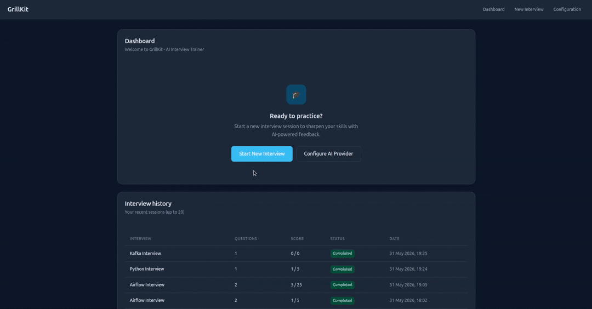

# GrillKit


[](https://www.python.org/downloads/)
[](https://opensource.org/licenses/Apache-2.0)
[](CHANGELOG.md)

Open-source AI technical interview trainer. Configure an OpenAI-compatible model, practice from YAML question banks, and get real-time scoring with optional voice input and question audio.

[Quick start](#quick-start) · [Changelog](CHANGELOG.md) · [Architecture](ARCHITECTURE.md)

## Screenshots & demo

**Dashboard** — recent sessions and quick start

<p align="center">
  
</p>

**Interview setup** — languages, levels, topics, and session options

<p align="center">
  
</p>

**Interview session** — real-time Q&A with AI scoring and final evaluation

<p align="center">
  
</p>

**Demo video** — full flow from setup to scored feedback

<p align="center">
  
</p>

## Features

- **Interviews** — multi-language setup, several topics per session, WebSocket Q&A, AI scoring 1–5, up to 2 follow-ups per question
- **Timer** — optional per-round time limit; expired rounds score 0 and the session moves on
- **Voice** — offline Whisper dictation for answers; optional Piper TTS to read questions aloud
- **Question banks** — Python and Database/SQL, junior / middle / senior (`data/questions/`)
- **Setup** — model catalog on `/config`, interview language, Whisper/Piper downloads from the UI
- **Dashboard** — recent interview history on the home page
- **Persistence** — SQLite (`data/db/grillkit.db`); Docker Compose on port 8000 with `./data` volume

## Roadmap

**Planned**

- Session-wide time limit (total interview duration)
- More question banks (Go, JavaScript, Java, C++, …)
- Code editor in the interview UI
- Custom question banks, PWA / standalone frontend

## Quick start

### Prerequisites

- [Docker](https://docs.docker.com/get-docker/) and [Docker Compose](https://docs.docker.com/compose/install/)
- API key for a cloud provider, **or** a local OpenAI-compatible server (Ollama, vLLM, …)

### Run with Docker

```bash
git clone https://github.com/yourusername/grillkit.git
cd grillkit
docker compose up --build
```

Open [http://localhost:8000](http://localhost:8000).

Optional **question voice** (Piper TTS, same `app` container):

1. Run `docker compose up` (or `uv run uvicorn app.main:app` for development).
2. Open `/config`, enable **Read questions aloud**, save.
3. On the Configuration page, use **Download question voice** when prompted (~60 MB per locale voice from Hugging Face).
4. Start an interview — questions can play aloud; WAV cache lives under `data/tts-cache/v2/{locale}/`.

`./data` on the host holds SQLite, `config.json`, `llm_models.json`, Whisper/Piper models, and TTS cache. Question banks, templates, and static files are in the image.

If bind-mounted `data/` is not writable (Linux UID mismatch):

```bash
PUID=$(id -u) PGID=$(id -g) docker compose up --build
```

### First-time flow

1. **Configuration** (`/config`) — add one or more OpenAI-compatible models to the catalog, select an interview model, set language; test connection, then save.
2. **New interview** (`/setup`) — enable one or more programming languages (level per language), select multiple topics, set total question count (at least one per selected topic; interview language is read-only from config).
3. **Interview** (`/interview/{id}`) — page loads history; answers and completion go over WebSocket.

Without saved provider config, `/setup` redirects to `/config`.

### Local development

```bash
uv sync --extra dev
uv run uvicorn app.main:app --reload
```

Same first-time flow at [http://127.0.0.1:8000](http://127.0.0.1:8000).

## Configuration

Any **OpenAI-compatible** HTTP API works (single adapter in code):

| Provider | Example base URL |
|----------|------------------|
| OpenAI | `https://api.openai.com/v1` |
| Ollama | `http://localhost:11434/v1` |
| vLLM / others | your endpoint + `/v1` |

### Model catalog

On `/config`, use **Add model to catalog** to save OpenAI-compatible providers (base URL, model name, optional API key). Entries are stored in [`data/llm_models.json`](data/llm_models.json) (gitignored). Select an interview model from the list, run **Test Connection**, then save.

Application settings and interview language (`locale`) live in `data/config.json` (gitignored). Do not commit secrets.

After saving configuration, choose a **Whisper** model size (`small`, `medium`, or `large`) and download it from the Configuration page (stored under `data/whisper-models/<size>/`). Dictation uses the interview language from `locale`. The app loads the model into memory when the download finishes or on the next startup.

**Read questions aloud** (`question_voice_enabled`) requests synthesized audio for question text only (never code blocks). Download the Piper voice on `/config` after enabling the option (~60 MB per voice from Hugging Face).

Optional environment variables:

| Variable | Purpose |
|----------|---------|
| `HF_TOKEN` | Hugging Face read token for faster, more reliable Whisper and Piper model downloads ([create token](https://huggingface.co/settings/tokens)). Passed through in `docker compose` when set on the host. |
| `WHISPER_DEVICE` | `cpu` or `cuda` (default `cpu`) |
| `WHISPER_COMPUTE_TYPE` | `int8` or `float16` (default `int8` on CPU) |

## Data layout

```
data/
├── config.json              # Locale, speech/TTS flags, timer defaults (gitignored)
├── llm_models.json          # Interview model catalog (gitignored)
├── db/grillkit.db           # SQLite (gitignored, created on startup)
├── whisper-models/          # Offline Whisper models per size (gitignored content)
├── piper-voices/            # Piper ONNX voices for question TTS (gitignored content)
├── tts-cache/               # Cached question WAVs per locale (gitignored content)
└── questions/               # YAML banks: {language}/{level}/{category}.yaml
```

There are no database migrations yet. After a schema change, remove `data/db/grillkit.db` and restart the app to recreate tables.

## Project layout

```
app/
├── main.py              # FastAPI app, routers, lifespan
├── interview/           # Sessions, WebSocket chat, scoring, timer
├── speech/              # Whisper download + dictation
├── question_voice/      # Piper TTS, cache, question audio API
├── platform/            # Provider config, LLM catalog (/config)
├── shared/              # DB, UoW, locales, artifact download helpers
└── ai/                  # OpenAI-compatible + faster-whisper adapters
templates/               # Jinja2 UI
static/                  # CSS, JS (dictation, timer, question voice)
tests/
ARCHITECTURE.md          # Layers, routes, data flows
```

## Development

CI runs on every pull request and on pushes to `main` (ruff, mypy, pytest). See [`.github/workflows/ci.yml`](.github/workflows/ci.yml).

```bash
uv sync --frozen --extra dev
uv run pytest
uv run ruff check --fix .
uv run ruff format .
uv run mypy .
```

See [CONTRIBUTING.md](CONTRIBUTING.md) for contribution guidelines.

## Security

Report vulnerabilities as described in [SECURITY.md](SECURITY.md). Do not open public issues for security problems.

## License

[Apache License 2.0](LICENSE) (see also [NOTICE](NOTICE))
