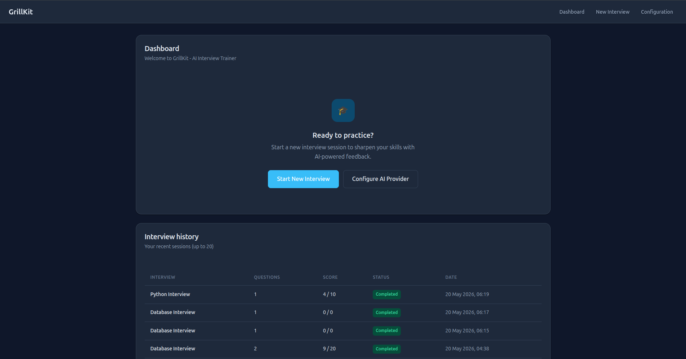
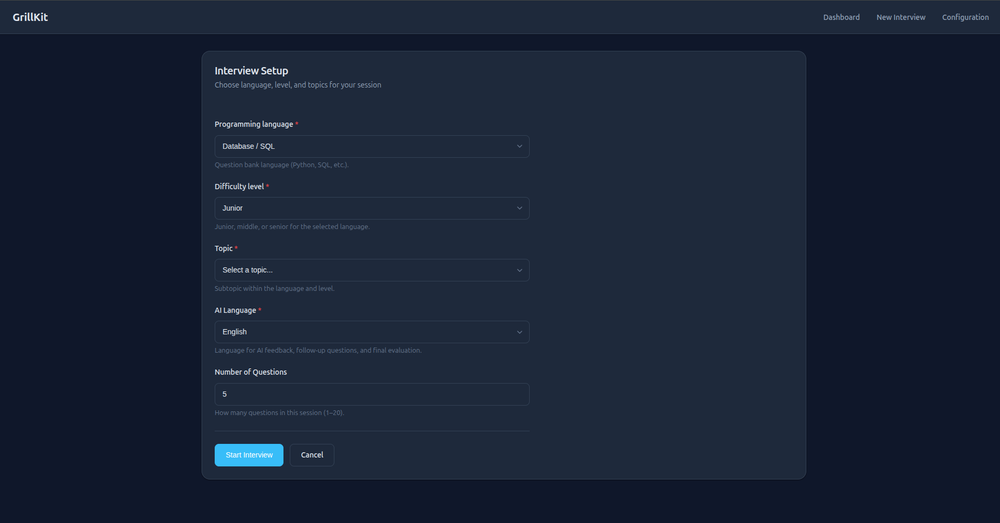
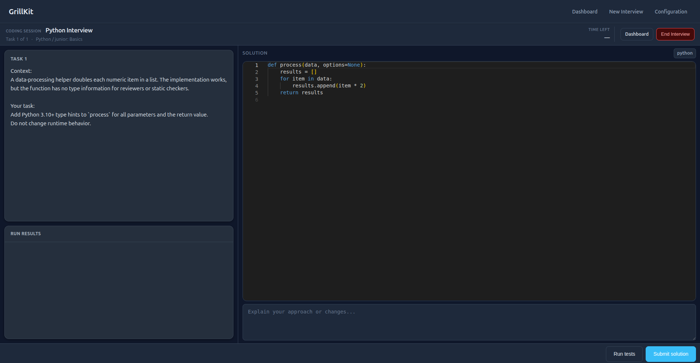
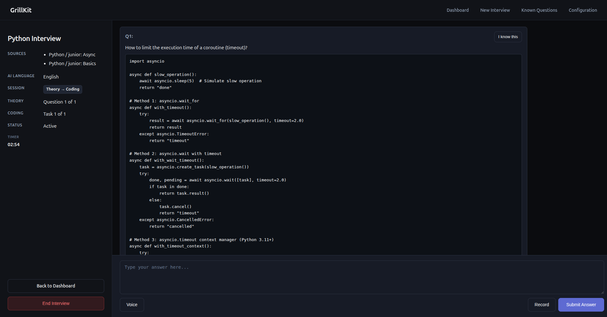

# GrillKit

[](https://www.python.org/downloads/)
[](https://opensource.org/licenses/Apache-2.0)
[](CHANGELOG.md)

Open-source AI technical interview trainer. Practice **theory Q&A**, **live coding**, or **both in one session** from curated YAML banks — with structured scoring, follow-ups, optional voice, and a local results history. Bring your own LLM (cloud or local).

[Why GrillKit](#why-grillkit-not-just-chatgpt) · [Quick start](#quick-start) · [Changelog](CHANGELOG.md) · [Architecture](ARCHITECTURE.md)

## Why GrillKit (not just ChatGPT)

A general chat assistant is flexible, but it does not run an **interview** for you.

| What you need | ChatGPT-style chat | GrillKit |
|---------------|-------------------|----------|
| Curated technical questions | You prompt each time | Built-in **tracks** (Python, Kafka, System Design, …), **levels**, and **topics** |
| Interview flow | Free-form thread | Fixed session: theory Q&A and/or coding tasks, up to **2 AI follow-ups** per item, **1–5 scoring**, session summary |
| Live coding practice | Paste code in chat | **Monaco editor**, **Run** against public tests, **Submit** for hidden tests + AI review (needs Judge0) |
| Practice history | Scattered chats | **Dashboard** with past sessions; open **results** and per-section **review** pages after completion |
| Skip what you already know | You repeat the same prompts | **Known questions** — mark bank items during practice; optionally exclude them when starting a new session |
| Time pressure | None | Optional **per-round timer** on theory and coding (expired round → 0, move on) |
| Voice practice | Depends on product | Offline **Whisper** dictation; optional **Piper** question audio; **audio answers** when your model supports it |
| Where data lives | Vendor cloud | **Self-hosted**: SQLite + `data/` on your machine; use **Ollama**, vLLM, or any OpenAI-compatible API |

**Structured practice** — You pick tracks, difficulty, and topics; GrillKit builds a question plan and keeps score across the whole session, not a single ad-hoc prompt.

**Privacy and control** — Run via Docker on your laptop or server. API keys and interview history stay under `./data` (gitignored). No account or subscription required beyond your LLM provider (if you use a cloud model).

## Screenshots & demo

**Demo video** — full flow from setup to scored feedback

https://github.com/user-attachments/assets/25655f1e-89d3-472f-8c1f-3f154df622b2


**Dashboard** — recent sessions and quick start

<p align="center">
  
</p>

**Interview setup** — question-bank tracks, levels, topics, and session options

<p align="center">
  
</p>

**Coding section** — Monaco editor, Run on public tests, Submit for AI evaluation

<p align="center">
  
</p>

**Theory section** — real-time Q&A with AI scoring and final evaluation

<p align="center">
  
</p>

## Features

### Session modes

Pick one mode on **New interview** (`/setup`):

| Mode | What you practice |
|------|-------------------|
| **Theory only** | Technical Q&A from `data/questions/` — type, dictate, or record answers |
| **Coding only** | Programming tasks from `data/coding/` — edit, Run, Submit |
| **Theory then coding** | Q&A first, then coding panel when theory finishes |
| **Coding then theory** | Coding first, then theory |

Coding modes need a running [Judge0](https://github.com/judge0/judge0) instance (see **Coding sessions** below).

### Practice tools

- **Theory** — WebSocket Q&A, AI scoring 1–5, up to 2 follow-ups per question
- **Coding** — Monaco editor, Run (`POST /coding/run`) on public tests, Submit (`WS /coding/ws`) with hidden tests and AI feedback
- **Question banks** — Python, Database/SQL, System Design, Kafka, RabbitMQ, Docker, Kubernetes, Observability, Airflow, and more (junior / middle / senior where applicable)
- **Timer** — optional per-round limit on theory and coding; expired rounds score 0 and the session moves on
- **Voice** — offline Whisper dictation; optional Piper TTS to read theory questions aloud
- **Audio answers** — record a WAV theory answer when your model supports audio input and Whisper is ready
- **Results hub** — after you finish, `/interview/{id}/results` shows overall evaluation and links to **theory** and **coding** review pages with full chat/code history
- **Known questions** — mark theory or coding bank items as **I know this** during an interview or on review pages; optionally exclude them on **New interview** setup; manage the list at `/known-questions/manage`
- **Dashboard** — recent sessions on the home page (completed sessions link to results)
- **Setup** — model catalog on `/config`, interview locale, Whisper/Piper downloads from the UI
- **Deployment** — Docker Compose on port 8000 with `./data` volume for config, DB, and models

## Quick start

### Prerequisites

- [Docker](https://docs.docker.com/get-docker/) and [Docker Compose](https://docs.docker.com/compose/install/)
- API key for a cloud provider, **or** a local OpenAI-compatible server (Ollama, vLLM, …)

### Run with Docker

```bash
git clone https://github.com/GrillKit/grillkit.git
cd grillkit
docker compose up --build
```

Open [http://localhost:8000](http://localhost:8000).

Optional **question voice** (Piper TTS, same `app` container):

1. Run `docker compose up` (or `uv run uvicorn app.main:app` for development).
2. Open `/config`, enable **Read questions aloud**, save.
3. On the Configuration page, use **Download question voice** when prompted (~60 MB per locale voice from Hugging Face).
4. Start an interview — questions can play aloud; WAV cache lives under `data/tts-cache/v2/{locale}/`.

`./data` on the host holds SQLite, `config.json`, `llm_models.json`, Whisper/Piper models, and TTS cache. Question banks, templates, and static files ship in the image.

If bind-mounted `data/` is not writable (Linux UID mismatch):

```bash
PUID=$(id -u) PGID=$(id -g) docker compose up --build
```

**Coding sessions** (Monaco + code execution) require [Judge0 CE](https://github.com/judge0/judge0). Start the optional `coding` profile:

```bash
docker compose --profile coding up --build
```

Judge0 listens on port `2358` inside the Compose network (`JUDGE0_URL=http://judge0-server:2358` for the `app` service). For local development without Docker, run Judge0 separately and point `JUDGE0_URL` at `http://localhost:2358`.

On some Linux hosts Judge0 needs **cgroup v1** (`systemd.unified_cgroup_hierarchy=0` in GRUB). Set `CODING_ENABLED=false` to hide coding modes when Judge0 is unavailable.

### First-time flow

1. **Configuration** (`/config`) — add one or more OpenAI-compatible models to the catalog, select an interview model, set interview locale; test connection, then save. Download Whisper (and optionally a Piper voice) from the same page if you want voice features.
2. **New interview** (`/setup`) — pick a **session mode** (theory only, coding only, or combined). Choose tracks, levels, topics, how many questions/tasks, optional per-round timers, and whether to **exclude known questions**. Coding modes require Judge0 (see **Coding sessions** above).
3. **Practice** (`/interview/{id}`) — answer theory questions in the chat (type, dictate, or record audio). On coding phases, use the editor: **Run** to check public tests, **Submit** when ready. Combined sessions switch panels automatically when a section ends (or use **Continue to Coding**). End the interview from the sidebar at any time.
4. **Review** (`/interview/{id}/results`) — after completion, read the overall evaluation, then open **Theory** or **Coding** review for full conversation history, scores, and feedback.

Without saved provider config, `/setup` redirects to `/config`.

### Local development

For contributors: see [CONTRIBUTING.md](CONTRIBUTING.md). Quick run:

```bash
uv sync --extra dev
uv run uvicorn app.main:app --reload
```

Same first-time flow at [http://127.0.0.1:8000](http://127.0.0.1:8000).

## Configuration (essentials)

Any **OpenAI-compatible** HTTP API works:

| Provider | Example base URL |
|----------|------------------|
| OpenAI | `https://api.openai.com/v1` |
| Ollama | `http://localhost:11434/v1` |
| vLLM / others | your endpoint + `/v1` |

On `/config`:

- **Add model to catalog** — display name, base URL, model name, optional API key (a stable catalog id is generated automatically from the display name); enable **Accepts audio input** only if the model supports multimodal audio (and download Whisper for transcription).
- **Interview model** — pick from the catalog, **Test Connection**, save.
- **Locale** — language for AI feedback and speech (stored in `data/config.json`, gitignored).
- **Whisper** — choose size (`small`, `medium`, `large`), download from the UI for dictation and audio answers.
- **Read questions aloud** — enable Piper, download a voice (~60 MB).

Do not commit `data/config.json`, `data/llm_models.json`, or API keys.

Optional environment variables (full list in [ARCHITECTURE.md](ARCHITECTURE.md#persistence--configuration)):

| Variable | Purpose |
|----------|---------|
| `DATABASE_URL` | SQLAlchemy URL (default: SQLite under `data/db/`) |
| `HF_TOKEN` | Hugging Face token for faster Whisper/Piper downloads |
| `WHISPER_DEVICE` | `cpu` or `cuda` |
| `WHISPER_COMPUTE_TYPE` | `int8` or `float16` |
| `CODING_ENABLED` | Enable coding session modes (default `true`; requires healthy Judge0) |
| `JUDGE0_URL` | Judge0 API base URL (default `http://localhost:2358`) |
| `JUDGE0_AUTH_TOKEN` | Optional Judge0 `X-Auth-Token` header |
| `CODING_MAX_RUNS_PER_TASK` | Max Run attempts per coding task (default `20`) |

## Roadmap

**Planned**

- Session-wide time limit (total interview duration)
- More question banks and categories
- Custom question banks, PWA / standalone frontend

## For developers

| Document | Contents |
|----------|----------|
| [ARCHITECTURE.md](ARCHITECTURE.md) | Feature modules, routes, data flows, persistence, test layout |
| [CONTRIBUTING.md](CONTRIBUTING.md) | Dev setup, quality checks, question/coding YAML guidelines |
| [CHANGELOG.md](CHANGELOG.md) | Release history |

## Security

Report vulnerabilities as described in [SECURITY.md](SECURITY.md). Do not open public issues for security problems.

## License

[Apache License 2.0](LICENSE) (see also [NOTICE](NOTICE))
